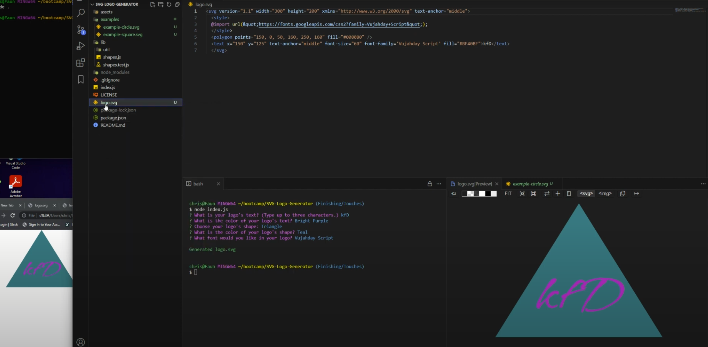

# SVG Logo Generator  

 ## Description
 
 **SVG Logo Generator Video Walkthrough Link: [Youtube Video](https://www.youtube.com/watch?v=b4VhrR389VU)** 
 
 This application will generate a logo SVG file.  
 It will create the logo based on your own input and choices.  
 You are able to choose the text, text color, shape, shape color, and font style.  
 You will need to answer a series of questions.  
 Once you have answered all the questions your logo will be generated.  
 
 ## Table of Contents
 
  - [Installation](#installation)
  - [Usage](#usage)
  - [Contributing](#contributing)
  - [Tests](#tests)
  - [Credits](#credits)
  - [License](#license)
  - [Questions](#questions)
 
 ## Installation
 
 Before using this application, you will need to install:
 1. node.js
 2. npm 
 3. Inquirer 8.2.4 
 4. Jest 26.5.2 (for testing)
 
 ## Usage
 
 1. Type `npm install -y` to install dependencies.  
 2. Run `node index.js` in the terminal.  
 3. Answer the questions displayed:  
 a. What is your logo's text? (Must select 3 characters or less)  
 b. What is the colorof your logo's text?  
 c. Choose your logo's shape:  
 d. What is the color of your logo's shape?  
 e. What font would you like in your logo?  
**Preview:**  
  
 
 
 ## Contributing
 
 Created by: Christian Palacios
 
 To contribute to this repository you may contact me for further details.  
 Contact details below in the Questions Section.
 
 ## Tests

 **Jest was used for testing this application.**  
 For testing you will need to use Jest version 26.5.2.  
 To install you will need to run `npm install -y`.  
 Once installed, you may run `npm run test` to test our shapes.  
 The application will perform the test on our shapes.test.js to test the code on shapes.js.  
 All eight test passed on this application.  
 **Preview:**  
  
 
 ## Credits
 
Code to create color and hexadecimal list created from scratch by referencing [https://htmlcolorcodes.com/colors/](https://htmlcolorcodes.com/colors/).  
This website has an excellent list of colors and their hexadecimal equivalent. 
 
 ## License

   
 **The MIT License**  
 Please refer to the LICENSE in the repository.

 ## Questions
 
 **If you have any questions you may reach me at my email: [cont_rune_encoder@outlook.com](mailto:cont_rune_encoder@outlook.com)**  

 **Here is a link to my Github Profile: [Profile Link: rune-encoder](https://github.com/rune-encoder)**  

 **If you would like to check out my other projects visit this link: [Projects Link: rune-encoder](https://github.com/rune-encoder?tab=repositories)**  
    

## Screenshot
 >Application Screenshot
  